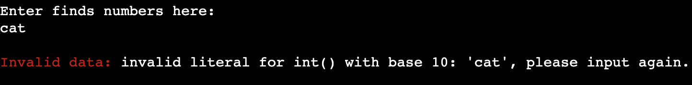

# ArchaeoTrack
ArchaeoTrack is a Python terminal application, which runs in the Code Institute mock terminal on Heroku.

It is an archaeological finds manager which tracks the number of finds from each day of excavation, calculates the daily and all time totals of each material type, then stores the data on Google Sheets.

[Live deployment link](https://archaeo-track-cd104451ef31.herokuapp.com/)

## Planning

### Project Aims
The first phase of planning for the project was centred around the pin-pointing who the target audience is, the aims of the project, and how these aims will be met:

- Who is the project for?
    - The project is archaeologists, commercial archaeological companies, and researchers.
- The aims of the project:
    - To provide an app that efficiently recieves, stores, and analyses finds data.
- How will the aims be met?
    - Excess information will be kept to a minimum.
    - Total number of pieces of each material type will be automatically calculated.

### Flowchart
Before work began on the coding side of the project, a flowchart was produced to clearly map the route the user takes in order to use the application, and how any invalid input will be handled.

### Design
Due to the nature of the application being function rather than fun, visual design was kept to a bare minimum. Headings are emphasised using ASCII art, red text is used to highlight invalid data, and green text is used to highglight valid data and successful updates.

## Features

### Existing Features

- Introduction Screen

The introduction screen is shown when the user starts the program. The name of the program is emphasised at the top of the screen with ASCII art, and a brief description of the program is underneath. If a log for the excavation area exists, it is shown in the list. The user is asked whether the area they want to update already exists. If so they enter "y" and are asked to enter the name of the area. If they answer "n" they are asked to enter the name of the excavation area they to create a log for. If they answer incorrectly they are warned and are asked to input again. Examples of this can be seen in the [invalid data handling section](#Invalid-Data-Handling).

- Finds data collection

Once an area is correctly selected, the user moves onto the data collection screen. Here they can enter the number of pieces of each material type found today in that excavation area. Instructions are given on how to input this data correctly. If inputted incorrectly, the user is warned and are asked to input again. This can be seen in the [invalid data handling section](#Invalid-Data-Handling).
The correctly inputted data is then updated on the relevant worksheet on the Google Sheets spreadsheet, and is added to the session totals list and the running report list.

- Succesfull Update Screen

Once the finds data is inputted correctly, the user arrives at the next screen. Here they are told the log was successfully updated, which is emphasised by the use of green text, they are shown the running report, so they have a reminder of what has already been inputted, and finally they are asked whether or not they would like to update another area. If they answer "y", they are taken back to the introduction screen, and the process starts again. If they answer "n" they are moved on to the exit screen. Much like the instances where the user is asked to input either "y" or "n", if inputted incorrectly the user is warned and asked to try again.

- Exit Screen

Once the user has decided all of the finds data for the day is inputted they are moved on to the exit screen. Here they area thanked for using the service, and are shown the total finds from the session and the total finds to date.

### Invalid Data Handling

- Area Already Exists

- Area doesn't exist

- Data can't be converted to integer

- Not enough values inputted

### Future Features

#### Ease of Future Development

## Tools and Technologies

## Testing and Validation

### Validation

### Manual Testing

### Bug Fixing

## Deployment

## Credits