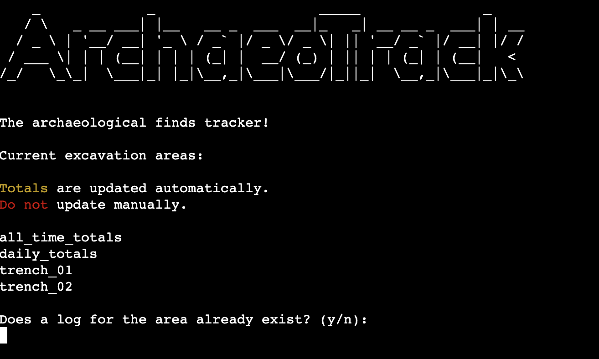

# ArchaeoTrack
ArchaeoTrack is a Python terminal application, which runs in the Code Institute mock terminal on Heroku.

It is an archaeological finds manager which tracks the number of finds from each day of excavation, calculates the daily and all time totals of each material type, then stores the data on Google Sheets.

[Live deployment link](https://archaeo-track-cd104451ef31.herokuapp.com/)

## Planning

### Project Aims
The first phase of planning for the project was centred around the pin-pointing who the target audience is, the aims of the project, and how these aims will be met:

- Who is the project for?
    - The project is archaeologists, commercial archaeological companies, and researchers.
- The aims of the project:
    - To provide an app that efficiently recieves, stores, and analyses finds data.
- How will the aims be met?
    - Excess information will be kept to a minimum.
    - Total number of pieces of each material type will be automatically calculated.

### Flowchart
Before work began on the coding side of the project, a flowchart was produced to clearly map the route the user takes in order to use the application, and how any invalid input will be handled.

### Design
Due to the nature of the application being function rather than fun, visual design was kept to a bare minimum. Headings are emphasised using ASCII art, red text is used to highlight invalid data, and green text is used to highglight valid data and successful updates.

## Features

### Existing Features

- Introduction Screen

- Finds data collection

- Succesfull Update Screen

- Invalid Data Handling

### Future Features

#### Ease of Future Development

## Tools and Technologies

## Testing and Validation

### Validation

### Manual Testing

### Bug Fixing

## Deployment

## Credits