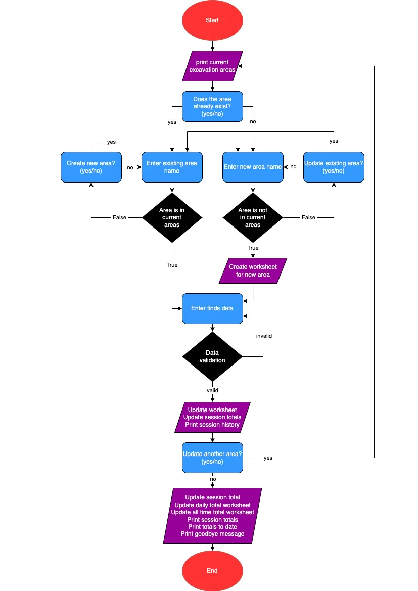

# ArchaeoTrack
ArchaeoTrack is a Python terminal application, which runs in the Code Institute mock terminal on Heroku.

It is an archaeological finds manager which tracks the number of finds from each day of excavation, calculates the daily and all time totals of each material type, then stores the data on Google Sheets.

[Live deployment link](https://archaeo-track-cd104451ef31.herokuapp.com/)

## Planning

### Project Aims
The first phase of planning for the project was centred around the pin-pointing who the target audience is, the aims of the project, and how these aims will be met:

- Who is the project for?
    - The project is archaeologists, commercial archaeological companies, and researchers.
- The aims of the project:
    - To provide an app that efficiently recieves, stores, and analyses finds data.
- How will the aims be met?
    - Excess information will be kept to a minimum.
    - Total number of pieces of each material type will be automatically calculated.

### Flowchart
Before work began on the coding side of the project, a flowchart was produced to clearly map the route the user takes in order to use the application, and how any invalid input will be handled.

### Design
Due to the nature of the application being function rather than fun, visual design was kept to a bare minimum. Headings are emphasised using ASCII art, red text is used to highlight invalid data, and green text is used to highglight valid data and successful updates.

## Features

### Existing Features

- Introduction Screen

The introduction screen is shown when the user starts the program. The name of the program is emphasised at the top of the screen with ASCII art, and a brief description of the program is underneath. If a log for the excavation area exists, it is shown in the list. The user is asked whether the area they want to update already exists. If so they enter "y" and are asked to enter the name of the area. If they answer "n" they are asked to enter the name of the excavation area they to create a log for. If they answer incorrectly they are warned and are asked to input again. Examples of this can be seen in the [invalid data handling section](#Invalid-Data-Handling).

- Finds data collection

Once an area is correctly selected, the user moves onto the data collection screen. Here they can enter the number of pieces of each material type found today in that excavation area. Instructions are given on how to input this data correctly. If inputted incorrectly, the user is warned and are asked to input again. This can be seen in the [invalid data handling section](#Invalid-Data-Handling).
The correctly inputted data is then updated on the relevant worksheet on the Google Sheets spreadsheet, and is added to the session totals list and the running report list.

- Succesfull Update Screen

Once the finds data is inputted correctly, the user arrives at the next screen. Here they are told the log was successfully updated, which is emphasised by the use of green text, they are shown the running report, so they have a reminder of what has already been inputted, and finally they are asked whether or not they would like to update another area. If they answer "y", they are taken back to the introduction screen, and the process starts again. If they answer "n" they are moved on to the exit screen. Much like the instances where the user is asked to input either "y" or "n", if inputted incorrectly the user is warned and asked to try again.

- Exit Screen

Once the user has decided all of the finds data for the day is inputted they are moved on to the exit screen. Here they area thanked for using the service, and are shown the total finds from the session and the total finds to date.

### Invalid Data Handling

- Area Already Exists

If the user has decided to create a log for a new area, but they enter the name of an area that already exists, they are thrown this warning. They are then asked whether or not they would like to update an existing area.

- Area doesn't exist

If the user has decided to update an area for which a log already exists, but they enter an incorrect area name, this warning is given. They are then asked whether or not they would like to create a new area.

- Data can't be converted to integer

If the user inputs the incorrect data type when the finds data is being collected, the data cannot be converted to an integer. The user is thrown this error and asked to input the data again.

- Not enough values inputted

If the user does not input enough values when the finds data is being collected, they are thrown this error message and asked to input the data again.

- Yes or no questions invalid input

As has been explained throughout the features section, often the user is asked to answer a quesiotn with either "y" representing yes, or "n" representing no. In each case, if something other than "y" or "n" is entered, the user is given this warning, and asked to answer again.

### Future Features

Due to time constraints, there are a number of features yet to be implemented. For example:
- In future the user will have the ability to edit the existing rows of data from within the program. This will then automatically update the relevant sheets.
- The user will also be able to delete logs/sheets from the terminal.
- If the user attempts to update an area for which a log for the day already exists, they will be shown the day's log and asked if they still want to update it. This is to prevent data being inputted twice.
- To do all of the above, the user must also have the ability to view all existing data from within the terminal, so that is also a feature to be implemented in the future.

#### Ease of Future Development

A number of steps were taken in order to make future development as simple as possible. One of these is that each function is clearly commented with concise detail, in order to explain what each part of the function does. This would help any future developer to understand what they are looking at, even if they have never read the code before. All variables and functions are named according to what they are or what they do, making it easy to understand. The code is also well spaced and adhears to the PEP8 python standards, to keep the readability of the code as a high a standard as possible.

## Tools and Technologies

- Python was the programming used.
- The Code Institute's mock terminal template was used to create the terminal.
- ASCII art was used to create the header styling in the terminal.
- Google Sheets was used to store the data.
- Gspread was imported to the project to allow manipulation of the Google Sheets spreadsheet from the terminal.
- Pyfiglet was imported to the project for constant [validation](#Validation).
- Datetime was imported to the project to allow for the data to be inputted into the spreadsheet with date information.
- Colorama was imported to allow for coloured text within the terminal.
- Git was used for version control.
- GitHub was used to store the code.
- GitPod was the online IDE used.
- Heroku was used for [deployment](#Deployment).
- Am I Responsive was used to create the image at the top of this document.

## Testing and Validation

### Validation

As previously mentioned in the [tools and technologies secion](#Tools-and-Technologies), pyfiglet was used for constant linting and validation during the coding process, making sure all code is syntactically and stylistically correct, according to the standard PEP 8 style.

### Bug Finding and Fixing

Throughout the coding process whenever a new feature was added, it was thoroughly manually tested to ensure correct functionality. A number of different data types were inputted, correct and incorrect, valid and invalid, so that all possible bases were covered. This testing process gave light to a small number of issues that needed to be resolved in order the project to move forward. These included:
- All time totals would throw an error and not calculate when the user inputted data for the first time. This was because the first row of cells of the all time totals sheet had no values, therefore no total could be calculated. This was solved by adding zeroes to the first row of cells before inputting any data into the application.
- Invalid names being accepted as an existing area. At first when choosing an existing area, if the user inputted part of an area name but not the full name e.g. *trench_0* the program would accept it as a valid input, and then throw an error saying the relevant sheet doesn't exist. This was solved by splitting and enumerating the sheet names grabbed using gspread. For example: original title "worksheet 'trench_02' id:03" - new title "trench_02".

## Deployment

## Credits

| Source | Usage |
| -------| ----- |
| Code institute | Four functions from the Love Sandwiches walkthrough project: get_finds_date, validate_data, update_worksheet and calculate_all_time_totals  |
| Code Institute | Mock terminal template for deployment |